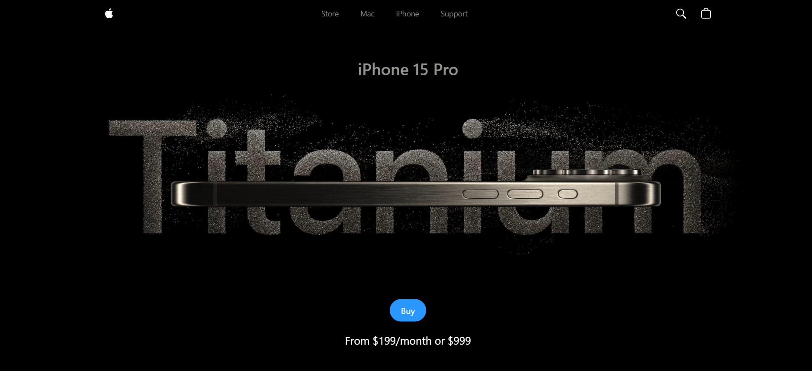

# Apple Website Prototype

This project is a prototype of the Apple website, developed using React and Vite. It aims to replicate the design and functionality of the official Apple website for educational and demonstration purposes.

## Live Demo

Experience the live version of this prototype here: [Apple Website Prototype](https://apple-website-prototype-git-main-abhilov-projects.vercel.app/)

## Features

- **Responsive Design**: Optimized for various screen sizes, ensuring a seamless experience across devices.
- **Interactive Elements**: Includes interactive components to mimic the user experience of the official site.
- **Modern Technologies**: Built with React, Vite, and Tailwind CSS for efficient development and performance.

## Installation

To run this project locally, follow these steps:

1. **Clone the repository**:

   ```bash
   git clone https://github.com/abhilov23/Apple_website_prototype.git
   ```

2. **Navigate to the project directory**:

   ```bash
   cd Apple_website_prototype
   ```

3. **Install dependencies**:

   ```bash
   npm install
   ```

4. **Start the development server**:

   ```bash
   npm run dev
   ```

   The application should now be running at `http://localhost:3000`.

## Deployment

This project is deployed using Vercel. For more information on how to deploy React applications with Vercel, refer to their [official documentation](https://vercel.com/docs).

## Showcase

Below is a showcase of the project:



*Note: Ensure that the image named `view.png` is available in the `assets` folder. If the file name or path is different, update it accordingly.*

## Technologies Used

- **React**: JavaScript library for building user interfaces.
- **Vite**: Next-generation frontend tooling for rapid development.
- **Tailwind CSS**: Utility-first CSS framework for styling.
- **Vercel**: Platform for frontend frameworks and static sites.

## Contributing

Contributions are welcome! Please follow these steps to contribute:

1. Fork the repository.
2. Create a new branch for your feature or fix: `git checkout -b feature-name`
3. Commit your changes: `git commit -m "Add your message here"`
4. Push to the branch: `git push origin feature-name`
5. Open a pull request.

## License

This project is licensed under the MIT License. See the [LICENSE](./LICENSE) file for more details.
